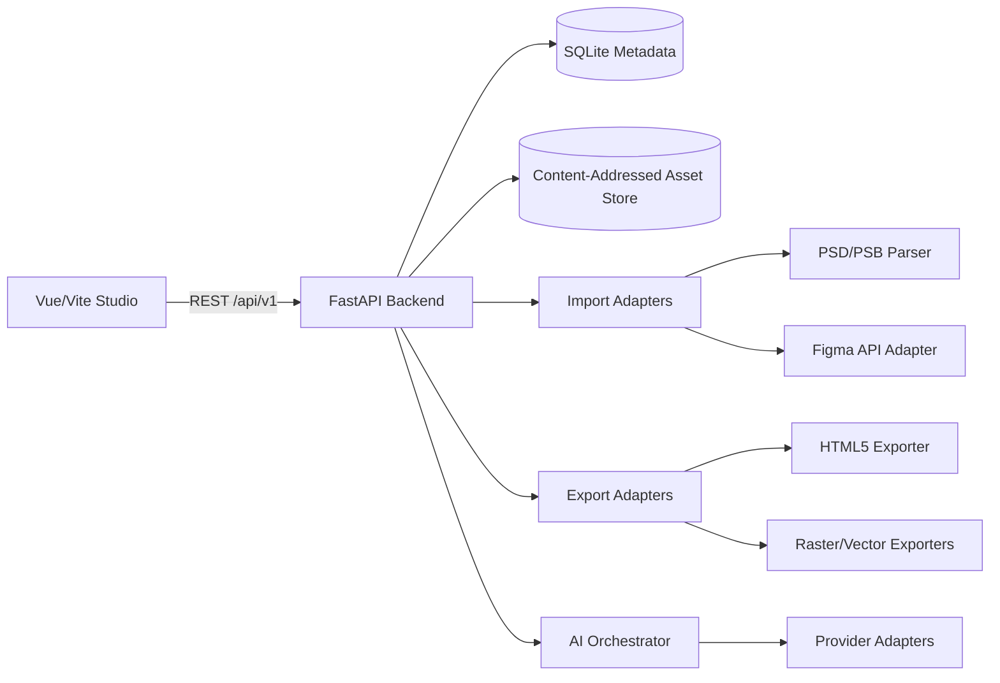

# Ubiqx AI Studio Architecture

Status: Baseline for v1
Last updated: 2026-08-13

## Purpose

This file describes the v1 system structure and boundaries. It is intentionally simpler than a cloud SaaS architecture because v1 is local-first.

## System Overview



## Component Responsibilities

### Front End

- `Project shell`: project list, navigation, and empty states.
- `Canvas`: infinite CanvasKit view over the scene graph (unbounded coordinate space, no fixed artboard).
- `Layers panel`: hierarchy, visibility, lock, and selection.
- `Properties panel`: editing for selected nodes.
- `Import/export UI`: file upload, import status, export package actions.
- `AI task UI`: create, poll, and cancel AI tasks.
- `Autosave client`: debounced mutation submission.

### Back End

- `API`: FastAPI routes, validation, auth, and generated OpenAPI.
- `Project service`: project CRUD and autosave coordination.
- `Scene service`: scene-graph mutations, ordering, and consistency.
- `Import adapters`: format-specific parsers that emit a normalized scene graph.
- `Export adapters`: target-specific exporters that read the scene graph.
- `AI orchestrator`: task lifecycle, provider routing, retries, cancellation, and usage tracking.
- `Storage`: SQLite metadata and content-addressed file storage.
- `Auth`: local user profile, API keys, and scopes.

## Data Flow

### Import

1. The user uploads a PSD/PSB or supported image.
2. The API validates and stores the source file safely.
3. The import adapter parses the source.
4. The adapter emits a normalized scene graph and extracts binary assets.
5. The scene service persists the graph and associates assets.
6. The front end renders the graph through CanvasKit.

### Canvas Edit

1. The user performs a canvas operation.
2. The front end sends a scene mutation to the API.
3. The API validates the mutation and updates the scene graph.
4. The front end updates CanvasKit from the returned scene state.
5. Autosave and undo history use the same mutation path.

### Export

1. The user requests an HTML5 or asset export.
2. The export service reads the scene graph and referenced assets.
3. The target adapter renders or packages the output.
4. The export job returns a validated package or a warning report.

### AI Task

1. The user requests an AI operation.
2. The orchestrator creates a persisted task and returns its ID.
3. A local runner executes the selected provider through an adapter.
4. The provider response is normalized and written to an asset or scene update.
5. The front end polls task status and refreshes the relevant project state.

## Repository Layout

```text
apps/
  web/
  api/
packages/
  contracts/
  fixtures/
docs/
  m0/
  m1/
  ...
```

The exact monorepo tooling is decided in M0. The contract package contains generated OpenAPI and generated client types.

## Scene Graph as Source of Truth

- The backend persists the canonical scene graph.
- CanvasKit state is a projection of the graph.
- The front end never treats canvas objects as the durable data model.
- Mutations are expressed as small operations over scene nodes.
- Undo/redo is applied at the scene-mutation level.

## Infinite Canvas

- The scene graph lives in an unbounded coordinate space; there is no fixed scene resolution.
- The stored scene `width`/`height` is a default viewport and source-size hint only.
- `fitView` frames the visible content's bounding box rather than a fixed artboard.
- Export adapters derive the output bounds from the visible content's bounding box plus padding.

## Import and Export Adapters

Adapters hide format-specific behavior from the scene and project services.

- Import adapters accept a source file and return a normalized scene graph plus assets.
- Export adapters accept a scene graph plus assets and return a package or rendered asset.
- Each adapter records unsupported features as warnings.
- The common interfaces are stable even when parser or exporter internals change.

## AI Provider Adapters

The orchestrator does not depend on a specific provider.

- Text providers: OpenAI, Anthropic, and DeepSeek-compatible interfaces.
- Image providers: GPT Image v2 and Nano Banana.
- Adapters normalize provider responses and errors.
- Credentials are resolved server-side and never sent to the browser.

## Local-First Execution

- FastAPI and SQLite run on the user's machine.
- Assets are stored in a local content-addressed directory.
- AI tasks initially run in a process-local worker.
- The process-local runner can later be replaced by an external queue without changing API contracts.

## API Boundary

- All front-end operations use `/api/v1`.
- OpenAPI is generated from FastAPI and committed.
- The web app and future agent clients share the same contract.
- MCP is deferred until the REST API and scene model are stable.

## Security Boundaries

- Imported files are untrusted and isolated through validation and safe storage paths.
- User-provided names are metadata, not filesystem paths.
- Provider secrets are backend-only.
- API keys are hashed at rest.
- Mutating operations are authorized per project scope.

## Future Evolution

- Replace SQLite with a server database when cloud projects arrive.
- Replace the local task runner with a distributed queue.
- Add an MCP server as a thin adapter over the same services.
- Add Unity, Godot, Cocos Creator, and Unreal exporters as new export adapters.
- Add real-time collaboration as a transport layer over scene mutations.
