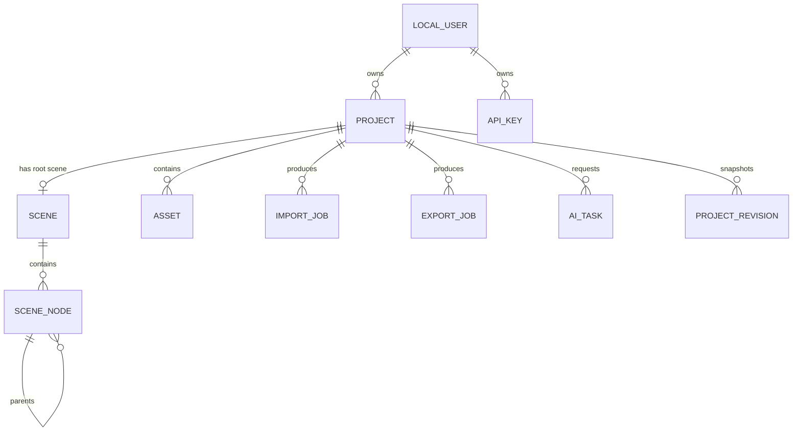

# Ubiqx AI Studio Data Model

Status: Baseline for v1
Last updated: 2026-08-13

## Purpose

This file defines the v1 entities, relationships, and invariants. The REST API in `API-CONTRACT.md` exposes these entities as JSON resources.

## Naming and Types

- All entity IDs are UUID strings.
- Timestamps are UTC ISO 8601 strings.
- Scene coordinates use device-independent units.
- Colors are stored as structured RGBA values where possible.
- Arbitrary format-specific data is stored as JSON metadata.

## Entity Summary

## LocalUser

The v1 local user is a single machine-level profile, not a full identity system.

Fields:

- `id`
- `display_name`
- `created_at`
- `updated_at`

## ApiKey

Fields:

- `id`
- `user_id`
- `key_hash`
- `name`
- `scopes`
- `created_at`
- `expires_at`
- `last_used_at`

Invariants:

- Plaintext keys are not stored.
- Expired or revoked keys cannot authenticate.
- Scopes are evaluated on every request.

## Project

Fields:

- `id`
- `user_id`
- `name`
- `root_scene_id`
- `status`: `active`, `archived`, `deleted`
- `created_at`
- `updated_at`
- `last_autosaved_at`

Invariants:

- An active project has one root scene.
- Archive is reversible; delete is a soft delete in v1.

## Scene

Fields:

- `id`
- `project_id`
- `root_node_id`
- `width`
- `height`
- `created_at`
- `updated_at`
- `metadata`

Invariants:

- A scene has exactly one root node.
- The root node has no parent.
- All other nodes are descendants of the root.

## SceneNode

Fields:

- `id`
- `scene_id`
- `parent_id`
- `type`: `root`, `group`, `layer`, `text`, `image`, `shape`
- `name`
- `visible`
- `locked`
- `opacity`
- `transform`
- `asset_id`
- `text_properties`
- `style_properties`
- `effect_metadata`
- `order_index`
- `created_at`
- `updated_at`

Transform fields:

- `x`
- `y`
- `width`
- `height`
- `rotation`
- `scale_x`
- `scale_y`

Invariants:

- The scene graph is acyclic.
- A node belongs to exactly one scene.
- `asset_id` is required for raster image nodes and optional for other node types.
- `text_properties` is required for text nodes.
- `effect_metadata` preserves unsupported format effects.

## Asset

Fields:

- `id`
- `project_id`
- `content_hash`
- `media_type`
- `width`
- `height`
- `byte_size`
- `storage_path`
- `source`
- `metadata`
- `created_at`

Invariants:

- `content_hash` is the SHA-256 of the raw asset bytes.
- `storage_path` is derived from `content_hash`, not from user input.
- The same bytes are stored once per local asset store.

## ImportJob

Fields:

- `id`
- `project_id`
- `source_file_id`
- `adapter`
- `status`: `queued`, `running`, `succeeded`, `failed`, `cancelled`
- `progress`
- `warnings`
- `error`
- `created_at`
- `started_at`
- `finished_at`

Invariants:

- A failed import does not replace the current project scene.
- Warnings are structured and preserve unsupported-feature information.

## ExportJob

Fields:

- `id`
- `project_id`
- `target`
- `status`: `queued`, `running`, `succeeded`, `failed`, `cancelled`
- `output_path`
- `manifest`
- `warnings`
- `error`
- `created_at`
- `started_at`
- `finished_at`

Invariants:

- An export is validated before `succeeded` is set.
- `manifest` lists all package outputs and referenced assets.

## AiTask

Fields:

- `id`
- `project_id`
- `provider`
- `operation`
- `input_asset_id`
- `output_asset_id`
- `status`: `queued`, `running`, `succeeded`, `failed`, `cancelled`
- `progress`
- `retry_count`
- `last_error`
- `usage`
- `created_at`
- `started_at`
- `finished_at`

Invariants:

- `retry_count` never exceeds the configured maximum.
- Cancelled tasks are never retried.
- `last_error` must not contain provider credentials or user secrets.

## ProjectRevision

Fields:

- `id`
- `project_id`
- `revision_number`
- `scene_snapshot`
- `created_at`

Invariants:

- A revision is immutable after creation.
- The latest revision is the recovery point for local autosave.

## Enumerated Status Values

Shared status values:

- `queued`
- `running`
- `succeeded`
- `failed`
- `cancelled`

Project status values:

- `active`
- `archived`
- `deleted`

## Persistence Notes

- SQLite holds all entity records.
- The asset store holds raw bytes.
- `scene_snapshot` and other large JSON fields are versioned JSON documents.
- Schema migrations are additive and reviewed before changing an existing contract.
